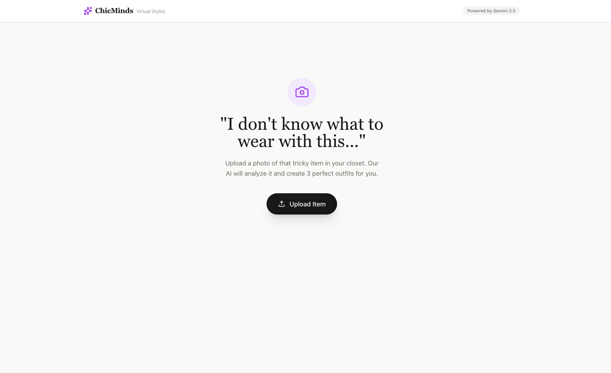
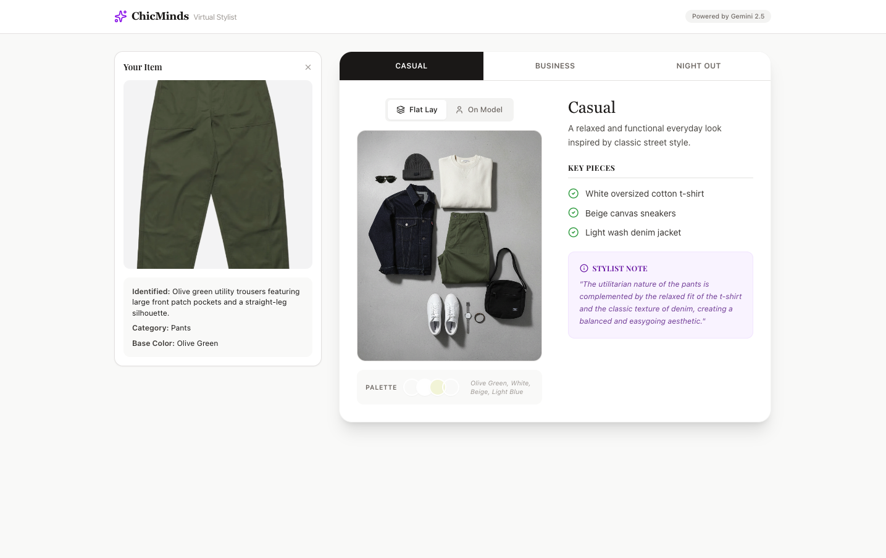
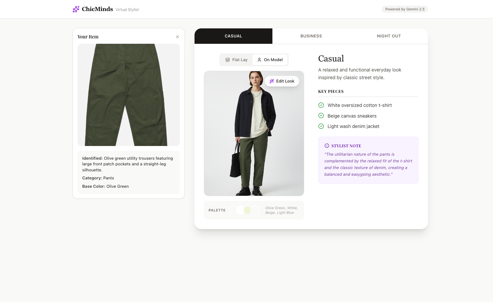

# ChicMinds Virtual Stylist

An AI-powered virtual stylist that analyzes clothing items and generates personalized outfit recommendations. Upload a photo of any item in your wardrobe, and receive three curated outfit suggestions tailored for different occasions: casual, business, and night out.

## Features

- **AI-Powered Analysis**: Advanced image recognition to identify clothing items, colors, and styles
- **Multi-Occasion Styling**: Get outfit suggestions for casual, business, and evening events
- **Visual Presentation**: View outfits as flat lay compositions or styled on a model
- **Detailed Recommendations**: Includes key pieces, color palettes, and stylist notes for each look

## Screenshots

  
  
<em>Upload your clothing item to get started</em>

  
  
<em>Browse outfit suggestions with flat lay visualization</em>

  
  
<em>Preview outfits styled on a model</em>

## Run Locally

**Prerequisites:** Node.js

1. Install dependencies:
   `npm install`
2. Set the `GEMINI_API_KEY` in [.env.local](.env.local) to your Gemini API key
3. Run the app:
   `npm run dev`
